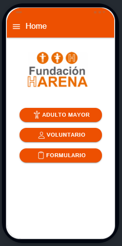
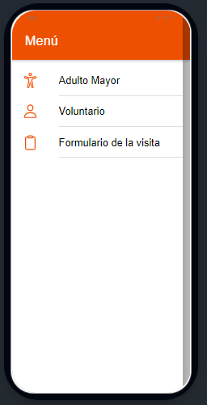
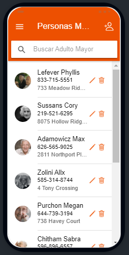
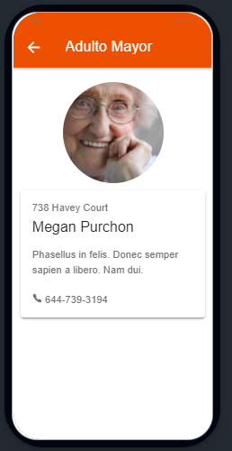
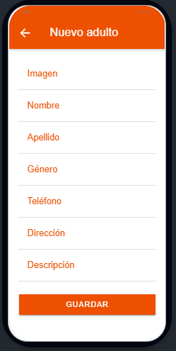
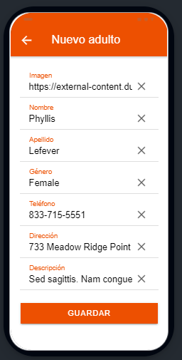
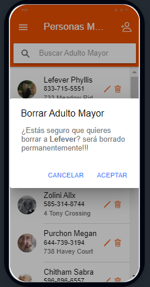
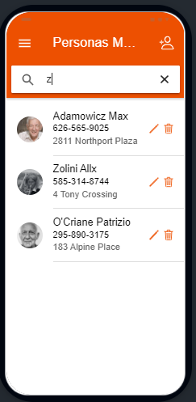

# COORDINATOR HARENA APP

La soledad es uno de los principales problemas sociales de España. Esta problemática ha crecido en un 50% en el 2020. La Fundación Harena contribuye a disminuir estos indicadores. Lo hace posible gracias a la labor encomiable de los voluntarios, que le dan acompañamiento a los adultos mayores de la ciudad de Málaga. 

Yo formo parte de este gran equipo. He sido voluntario desde que llegue a España, hace unos cinco años. Acompañaba a Antonio, que nos dejó a los 94 años, el año pasado. Actualmente, soy coordinador. Mi función es presentar a los voluntarios a los adultos mayores, realizar un informe de la visita y dar seguimiento al voluntariado.  

El informe se hace de manera manual, por lo que, me gustaría realizar una App que permita obtener la información de la visita y generar un informe que será almacenado en la base de datos de la Fundación. A continuación se presenta la primera etapa de esta aplicación.

### Home

En esta interface se muestran tres botones que nos llevan a las personas mayores, voluntarios y formulario. La interfaz de formulario está en construcción.

### Menú

### Interfaz que muestra una lista

Esta interfaz es la misma tanto para las personas mayores y los voluntarios

### Interfaz que muestra la información de las personas mayores y voluntarios

### Interfaz de creación

### Interfaz de edición

### Ventana de alerta para borrar

### Componente buscar

 
